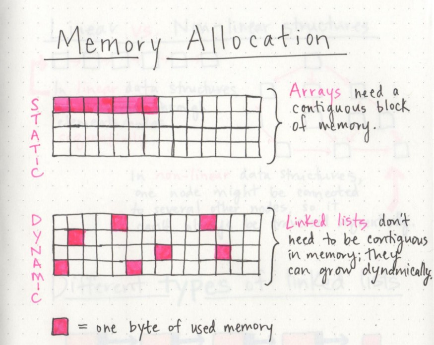
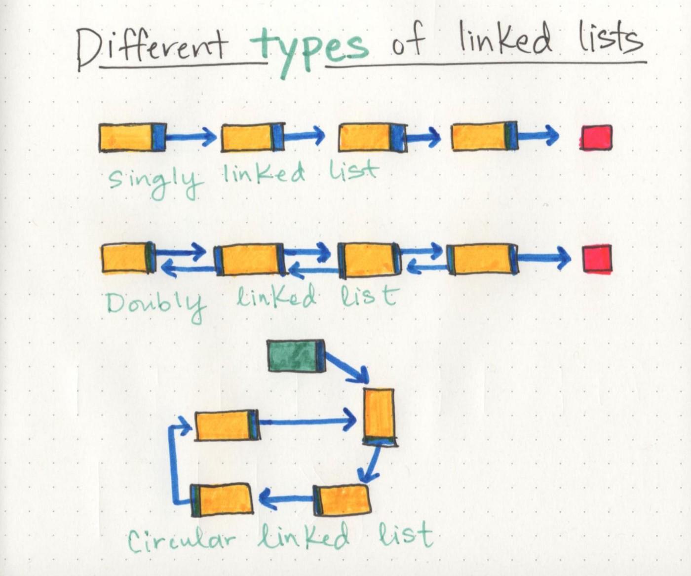

## Array

1. Array is the collection of contiguous memory location.
2. Linear in nature. Its indexing starts from 0. 
3. It Contains similar type of data type.
4. It is Fixed size data structure, you cannot modify size at runtime. (Cons)
5. Insertion/Deletion takes O(N) time in worst case. (Cons)
6. But Accessing takes O(1) time complexity. 

Now, we will try to remove disadvantages of Array in Linked List. 

## Linked List

A linked list is a linear data structure that contains a sequence of nodes, in which each node contains data and a pointer to another node. A linked list can be small or huge, but no matter the size, the parts that make it up are actually fairly simple. The starting point of the list is a reference to the first node, which is referred to as the head. 

A single node is also pretty simple. *It has just two parts: data, or the information that the node contains, and a reference to the next node.*

> **A node only knows about what data it contains, and who its neighbor is.**

A single node doesn’t know how long the linked list is, and it may not necessarily even know where it starts, or where it ends. All a node is concerned with is the data it contains, and which node its pointer references to — the next node in the list.

    

## Creation of Node datatype in C/C++ and Java

# C/C++

` struct Node{`
`   int data;`
`   struct Node* next;`
`}`

# Java or any OOP languages

`class Node{`
`   int data;`
`   Node next;`
`   public Node(int data){`
`       this.data = data;`
`       this.next = null`
`   }`
`}`

## Types of Linked List

# Singly Linked List
Singly linked lists are the simplest type of linked list, based solely on the fact that they only go in one direction. There is a single track that we can traverse the list in; we start at the head node, and traverse from the root until the last node, which will end at an empty null value.

# Doubly Linked List
A little modification to singly linked list will result in doubly linked list. In the node structure of linked list, instead of **next** pointer; use **left** and **right** pointer. I mean to say is, you can move in both direction from particular node.

# Circular Linked List

If we point the **next** pointer of **last node of single linked list to the first node**, instead of null. Then it is called circular linked list.

    

