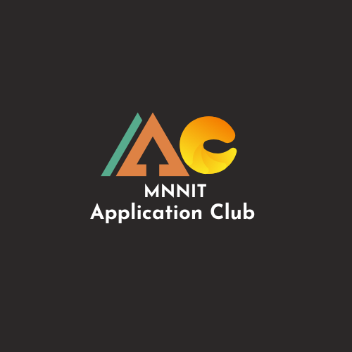

<head>
<link rel="shortcut icon" type="image/x-icon" href="favicon.ico">
</head>

<h1 align="center">
    MNNIT Application Club
</h1>

    

This repository contains the resources, support links and other relevant materials for every class under Application Club, MNNIT Allahabad,Prayagraj.

This repository is only open for PRs by AC-MNNIT-admins. Please DO NOT make a PR otherwise.

## Table of Contents

- [MNNIT-Application-Club](#mnnit-application-club)
  - [Table of Contents](#table-of-contents)
  - [About](#about)
  - [Resources](#resources)
  - [Contributors](#contributors)
  - [Contact](#contact)

## About

We are an educational club at Motilal Nehru National Institute Of Technology, Allahabad ,Prayagraj an Institute of National Importance. MNNIT Application Club as we call it is an official club of MCA, which aims at guiding the students for internships and placements.

Join our fb group for classes schedule and other details.

## Resources 
- Internship 
  - [30 Dec 2021 - STL/Collections(Vector, Iterator, ArrayList, Arrays)](Internship/2021-12-30_Class-1/)
  - [31 Dec 2021 - Git, GitHub](Internship/2021-12-31_Class-2/)
  - [03 Jan 2022 - Mathematics(Factorial, LCM, Euclidean Algo, Seive of Eratosthenes)](Internship/2022-01-03_Class-3/)
  - [05 Jan 2022 - Modular Arithmetic, Binary Exponentiation](Internship/2022-01-05_Class-4/)
  - [09 Jan 2022 - Binary Search, Two- Pointers, Sliding Window](Internship/2022-01-09_Class-5/)
  - [16 Jan 2022 - Prefix Sum, Bit Manipulation](Internship/2022-01-16_Class-6/)
  - [07 Fab 2022 - STL,Strings,Hashing](Internship/2022-02-07_Class-7/)

## Contributors

* [Anubhav Goel](https://github.com/AnubhavGoel2808)
* [Archit Keshri](https://github.com/architkeshri)
* [Asmit Mohan](https://github.com/Asmit-Mohan)
* [Md Nurul Islam](https://github.com/mdnuruli579)
* [Neeraj Joshi](https://github.com/Neeraj-2307)
* [Ojasvi Gupta](https://github.com/coder-oj)
* [Prakhar Gupta](https://github.com/Prakhar1106)
* [Rekha](https://github.com/Rekha-Pal)
* [Shanawaz Ali](https://github.com/shanawaz28)
* [Umang Aggarwal](https://github.com/Umang-19)
* [Vaishnavi Sharma](https://github.com/Vaishnavi-101)

## Contact

We would love to hear out your suggestions, if any. Reach out to us at <strong>[applicationclub.mnnit@gmail.com](mailto:applicationclub.mnnit@gmail.com)</strong>
